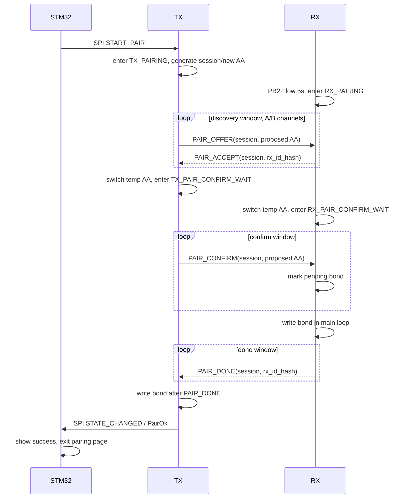

# RF PHY Hop 配对模式技术方案

> 目标：给 `RF_PHY_Hop` 的 TX/RX 增加独立配对模式，用于生成、交换、持久化 TX/RX 的专属 `accessAddress`，并通过 STM32 屏幕完成 TX 侧入口与配对结果反馈。

## 1. 需求边界

### 1.1 用户入口

- RX 入口：设备已经上电运行后，PB22 从高电平切到低电平并持续 5 秒，进入 RX 配对模式。
- TX 入口：STM32 屏幕主菜单的 `Connection` 详情页增加 `Pair 2.4G` 入口。
- STM32 点击入口后，通过 SPI 向 TX 发送 `START_PAIR(0x02)`。
- STM32 进入专用配对页，显示配对中、成功、超时/失败。
- TX 配对成功后，通过 SPI 通知 STM32；STM32 收到成功状态后退出配对页。

### 1.2 工程约束

- TX/RX 必须新增独立配对状态，避免污染当前 `UNCONNECTED / COMM / HOP_* / RECOVERY` 链路状态。
- 配对期间暂停正常输入空口发送、跳频事务和普通连接事务。
- 配对完成后，TX/RX 都持久化同一组 bond 参数，下次上电直接用 bond 的 `accessAddress` 建链。
- 当前只做 1 TX : 1 RX 绑定，后续多接收器/多设备再扩展 bond 表。

## 2. 参考方案摘要

市面方案的共同点不是“自动扫到就绑定”，而是由用户显式打开一个短时配对窗口。

- Xbox Wireless Controller 强调可在主机、Windows PC、移动设备间快速配对/切换，官方页面也把跨设备快速配对作为主要能力之一；对本项目的启发是：配对入口必须是明确 UI 动作，并且 UI 要给正在配对/成功的反馈。参考：[Xbox Wireless Controller](https://www.xbox.com/en-US/accessories/controllers/xbox-wireless-controller)。
- Logitech Unifying 由接收器侧维护绑定关系，一个接收器可配对最多 6 个兼容键鼠；对本项目的启发是：bond 应当是接收端也持久保存的记录，而不是只在 TX 或 STM32 上保存。参考：[Logitech Unifying Receiver & Software](https://support.logi.com/hc/en-au/articles/5470036605975-Unifying-Receiver-Software-Pairing-and-Troubleshooting)。
- Logi Bolt 是预配对优先，并且强调接收器与设备之间的加密/安全连接；对本项目的启发是：正式产品应避免永久开放配对，配对窗口要短，并且后续可升级为带密钥认证的握手。参考：[Logi Bolt 技术页](https://www.logitech.com/en-us/business/work-setups/logi-bolt-wireless-technology.html) 与 [Logi Bolt white paper](https://www.logitech.com/content/dam/logitech/en/business/pdf/logi-bolt-white-paper.pdf)。
- WCH 示例源码里对 access address 的注释建议避免 `0x55555555`、`0xAAAAAAAA`，位翻转次数不要超过 24，连续 0/1 不超过 6 个；本项目应把这个规则固化成 `rfh_access_address_valid()`。

结论：本项目第一版采用“物理双确认 + 短时 discoverable + 明文 Just Works”的工程方案。安全性依赖 TX 屏幕点击和 RX PB22 长按同时发生；后续如要量产强化，可在同一状态机里加入 per-device secret 和消息认证码。

## 3. 总体架构

### 3.1 新增状态

TX 侧新增：

- `TX_PAIRING`：收到 STM32 `START_PAIR` 后进入，停止普通 DATA/CONNECT/HOP。
- `TX_PAIR_CONFIRM_WAIT`：RX 已接受候选 bond，TX 切到新 `accessAddress` 等待最终 `PAIR_DONE`。

RX 侧新增：

- `RX_PAIRING`：PB22 长按触发，切到公共 discovery 参数，监听 TX 配对请求。
- `RX_PAIR_CONFIRM_WAIT`：RX 临时切到候选 `accessAddress`，等待 TX confirm，成功后写 bond。

这些状态独立于现有链路状态。退出配对后不恢复到中间跳频状态，统一进入 `UNCONNECTED`，让现有 CONNECT 流程重新建链。

### 3.2 配对参数

新增共享常量建议放在 `Common/include/rf_hop_protocol.h`：

```c
#define RFH_PAIR_ACCESS_ADDRESS        0x6D5A3C17UL
#define RFH_PAIR_CHANNEL_A             RFH_DISCOVERY_CHANNEL_A
#define RFH_PAIR_CHANNEL_B             RFH_DISCOVERY_CHANNEL_B
#define RFH_PAIR_WINDOW_MS             60000u
#define RFH_PAIR_CONFIRM_TIMEOUT_MS    3000u

#define RFH_CMD_PAIR_OFFER             0x30u
#define RFH_CMD_PAIR_ACCEPT            0x31u
#define RFH_CMD_PAIR_CONFIRM           0x32u
#define RFH_CMD_PAIR_DONE              0x33u
```

`RFH_PAIR_ACCESS_ADDRESS` 只用于发现与协商，不作为最终工作地址。最终 `link_access_address` 由 TX 生成，需通过 `rfh_access_address_valid()` 校验，并且不能等于默认地址或 pairing 地址。

### 3.3 Bond 记录

现有 `Common/include/rf_hop_bond.h` 已有 `rfh_bond_record_t` 雏形，建议扩成 v2：

| 字段 | 说明 |
|---|---|
| `magic/version/length` | 格式识别与迁移 |
| `link_access_address` | 配对后普通链路使用的 32-bit access address |
| `channel_a/channel_b` | 未连接/恢复时使用的双频道 |
| `rate_code` | 初始工作速率，后续仍可由 STM32 `SET_RATE` 更新 |
| `local_id_hash` | 本机芯片 ID 或 MAC 的短 hash |
| `peer_id_hash` | 对端短 hash，用于日志和避免误接受陈旧包 |
| `pair_counter` | 每次成功配对递增，辅助排查旧 bond |
| `checksum` | FNV-1a 或 CRC32 |

CH585/CH584 侧可用 Data-Flash/EEPROM 保存，地址沿用 `RFH_BOND_EEPROM_ADDR_DEFAULT`，写入前按 4KB erase block 做读改写。

## 4. 空口握手

复用 12B 空口包。当前 `type=3` 仍是保留值，建议定义为 `RFH_PKT_PAIR = 3`。配对包格式：

| Byte | 名称 | 说明 |
|---:|---|---|
| `0` | `hdr0` | `type=PAIR`，rate 可填当前档位 |
| `1` | `seq` | 配对会话低 8 bit |
| `2` | `cmd_id` | `PAIR_OFFER/ACCEPT/CONFIRM/DONE` |
| `3..6` | `session_nonce` | TX 生成，RX 原样回传 |
| `7..10` | `arg32` | `OFFER/CONFIRM` 为候选 `accessAddress`；`ACCEPT/DONE` 为 `rx_id_hash` |
| `11` | `meta` | ch/rate/status 压缩字段，或错误码 |

`PAIR_OFFER` 需要携带候选工作参数，但 10B payload 空间有限，建议这样压缩：

- `arg32 = proposed_access_address`
- `meta[1:0] = rate_code`
- `meta[4:2] = channel_a - RFH_MIN_CHANNEL` 的低 3 bit 不够，不建议压太多

更稳妥的方式是让第一版固定 `channel_a/channel_b = RFH_DEFAULT_CHANNEL_A/B`，配对只交换 `accessAddress`。跳频/信道优化仍交给现有 HOP 状态机。这样 12B 足够，风险也低。

### 4.1 握手流程



### 4.2 失败与重试

- TX pairing window：默认 60s，超时发送 SPI `STATE_CHANGED`，状态回 `Idle/Connecting`。
- RX pairing window：默认 60s，超时恢复原 bond 或默认地址，进入 `RX_UNCONNECTED`。
- 如果 TX 未收到 `PAIR_DONE`，TX 不写 bond；RX 即使已经写入 bond，也仍可通过 PB22 再次进入 pairing，用公共 discovery 地址重新配对。
- 收到 nonce 不匹配、access address 非法、cmd 顺序错误的包，一律丢弃并增加 reject 计数。

### 4.3 半双工收发窗口设计

CH58x RF 当前按半双工使用，同一时刻只能 TX 或 RX。因此配对模式也必须是 TDD（time division duplex），不能假设 TX/RX 同时收发。

#### 4.3.1 普通链路窗口

普通输入链路继续沿用现有“TX 主导 + 周期 ACK 窗口”：

```text
1s superframe

TX:  DATA/DATA/.../DATA  | guard | RX ACK window | next frame
RX:  RX  /RX  /.../RX    | guard | TX ACK burst  | RX
```

- TX 在每个正向 `CONNECT/DATA` 包的 `hdr1` 中携带距离 ACK 窗口的倒计时。
- RX 平时保持接收，看到倒计时接近 0 后，在 ACK 窗口切到 TX，重复发送 ACK。
- ACK 窗口内 TX 停止正向包并切 RX；RX 发 ACK 后立刻回 RX。
- 未连接双频道模式下，TX 正向包在 A/B 间轮换；ACK 窗口内 TX 也在 A/B 小片轮询监听，RX 在收到触发包的同一频道回 ACK。

#### 4.3.2 配对 discovery 窗口

配对 discovery 不走 8K 输入节拍，使用更慢但更稳的固定 TDD 小周期。建议第一版使用 16ms cycle：

```text
TX pairing cycle on public AA

0..4ms    ch A: TX PAIR_OFFER burst
4..8ms    ch A: RX PAIR_ACCEPT window
8..12ms   ch B: TX PAIR_OFFER burst
12..16ms  ch B: RX PAIR_ACCEPT window
repeat until accept or timeout
```

RX pairing 扫描：

```text
RX pairing scan on public AA

ch A RX dwell 8ms -> ch B RX dwell 8ms -> repeat
if PAIR_OFFER received:
    use offer.hdr1 countdown to enter the matching accept slot
    send PAIR_ACCEPT burst for 1..2ms on the same channel
    enter RX_PAIR_CONFIRM_WAIT
```

关键点：

- `PAIR_OFFER.hdr1` 不再表示普通 ACK 倒计时，而表示“距离 TX 打开 accept RX window 的 250us tick 数”。
- RX 收到 offer 后不马上回包，而是按 `hdr1` 对齐到 TX 的 listen slot。
- TX 的 accept window 至少 4ms，RX 的 accept burst 建议 1..2ms，前后各留 250us guard。
- TX 每个 burst 内重复发同一个 `session_nonce/proposed_access_address`，RX 用 nonce 去重。

#### 4.3.3 配对 confirm 窗口

TX 收到 `PAIR_ACCEPT` 后，双方切到候选 `accessAddress`，但 TX 仍然主导时序：

```text
TX confirm cycle on proposed AA

0..4ms   TX PAIR_CONFIRM burst
4..8ms   RX PAIR_DONE window
repeat until PAIR_DONE or confirm timeout
```

RX confirm 处理：

- RX 收到 `PAIR_CONFIRM` 后，先把候选 bond 标记为 pending。
- RX 在主循环执行 EEPROM 写入；写入期间可暂停 RF。
- TX 会继续重复 confirm cycle，所以 RX 写入完成后回到 RF RX，等待下一轮 `PAIR_CONFIRM`。
- RX 确认本地 bond 写入成功后，才在后续 done window 内重复发送 `PAIR_DONE`。
- TX 收到 `PAIR_DONE` 后再写自己的 bond，并通过 SPI 上报 `PairOk`。

这个设计牺牲了几十毫秒配对速度，换来两个好处：

- 不要求 TX/RX 精确同时切换收发，只要求 RX 根据 TX 包内 countdown 对齐回复窗口。
- RX 持久化失败时不会让 TX 误以为配对成功，从而避免 TX/RX bond 单边提交。

## 5. TX 侧实现方案

### 5.1 RF API

在 `TX/APP/include/RF_PHY.h` 增加：

```c
extern bool RF_StartPairing(void);
extern bool RF_StopPairing(void);
extern uint8_t RF_GetLinkStateCode(void);
extern bool RF_GetBonded(void);
```

`RF_StartPairing()` 负责：

- 保存当前状态用于日志，不在退出时恢复中间状态。
- 停止当前 ACK RX 或发送流程。
- 切换 `gParm/gTxParam/gRxParam.accessAddress` 到 `RFH_PAIR_ACCESS_ADDRESS`。
- 生成 `session_nonce` 和 `proposed_access_address`。
- 进入 `TX_PAIRING`。

`RF_StopPairing()` 负责取消 pairing，回到 `TX_UNCONNECTED`。

### 5.2 SPI bridge

`TX/APP/rfm_spi_bridge.c` 当前已解析 `START_PAIR/STOP_PAIR/UNBIND`，但只是回短事件。建议改为：

- `START_PAIR`：调用 `RF_StartPairing()`，返回完整 status payload，`state=Pairing`。
- `STOP_PAIR`：调用 `RF_StopPairing()`，返回完整 status payload。
- `UNBIND`：清除 TX bond，回默认地址，返回 `hasBond=0`。
- `GET_STATUS`：不再 hardcode `Connected`，改为读取 `RF_GetLinkStateCode()`、`RF_GetBonded()`、当前速率和 reject 计数。
- 配对成功时主动通过 IRQ 推送 `SPI_EVT_STATE_CHANGED`，payload 中 `state=PairOk`、`hasBond=1`。

STM32 侧现有 `RFLinkState::Pairing/PairOk` 已可承接这些状态。

## 6. RX 侧实现方案

### 6.1 PB22 长按检测

在 `RX/APP/RF_main.c` 增加非阻塞检测函数，每轮主循环调用：

- `GPIOB_ModeCfg(GPIO_Pin_22, GPIO_ModeIN_PU)`。
- 上电后必须先观察到 PB22 稳定高电平，之后才接受高到低长按，避免插电时按住导致误触发。
- 低电平 debounce 30ms。
- 低电平持续 5000ms 后触发一次 `RF_StartPairing()`。
- 配对中再次长按可作为取消，第一版也可以只允许超时退出。

### 6.2 RF API

在 `RX/APP/include/RF_PHY.h` 增加：

```c
extern void RF_StartPairing(void);
extern void RF_StopPairing(void);
extern uint8_t RF_IsPairingActive(void);
```

RX 进入 pairing 后：

- 停止普通 scan/comm/hop。
- 切换到 `RFH_PAIR_ACCESS_ADDRESS`。
- 在 `RFH_PAIR_CHANNEL_A/B` 间扫描。
- 收到合法 `PAIR_OFFER` 后临时记录候选 `accessAddress`，回 `PAIR_ACCEPT`。
- 切到候选 `accessAddress` 等 `PAIR_CONFIRM`。
- 收到 confirm 后先把候选 bond 标记为 pending，在主循环里写入 EEPROM；写入成功后再重复发送 `PAIR_DONE` 若干次，提高 TX 收到成功事件的概率。

LED 建议：

- 未连接：保留现有 300ms blink。
- Pairing：100ms 快闪。
- PairOk：常亮 1s 后恢复普通状态。

## 7. STM32 application 与屏幕方案

### 7.1 Connection 菜单

文件入口：

- `application/Cpp_Core/Src/screen_control/spi_screen_detail_tournament_mode.cpp`
- `application/Cpp_Core/Src/screen_control/spi_screen_manager.cpp`
- `application/Cpp_Core/Inc/connection_manager.hpp`
- `application/Cpp_Core/Src/connection_manager.cpp`
- `application/Cpp_Core/Inc/rf_transport.hpp`
- `application/Cpp_Core/Src/rf_transport.cpp`

`Connection` 详情项建议改为：

| 项 | 行为 |
|---|---|
| `USB` | 保持现有逻辑 |
| `2.4G 1K/2K/4K/8K` | 保持现有逻辑 |
| `Pair 2.4G` | 不直接改变速率，调用 `CONNECTION_MANAGER.startRfPairing()` 并打开配对页 |
| `Unbind 2.4G` | 可选，二期加入，调用 `unbind()` |

### 7.2 ConnectionManager

新增方法：

```cpp
bool startRfPairing();
bool stopRfPairing();
bool isRfPairing() const;
bool hasRfPairSucceeded() const;
RFModuleStatus getRfStatus() const;
```

行为建议：

- 即使当前 `connectionMode=USB`，也允许短暂打开 RF transport 发送 `START_PAIR`，因为这是配置动作。
- 配对中每 100-200ms 调用 `pollStatus()`，直到 `RFLinkState::PairOk` 或超时。
- 收到 `PairOk` 后，可将 `connectionMode` 设为 `RF24G`、`inputMode` 设为 `XINPUT` 并延迟保存；如果不想自动切模式，则只保存 bond，不动用户连接配置。建议第一版“配对成功后自动切 RF24G”，符合用户点击 `Pair 2.4G` 的预期。

### 7.3 专用配对页

在 `spi_screen_manager.cpp` 增加一个轻量 overlay 状态，而不是把配对页塞进普通列表详情：

- `g_pairingPageActive`
- `g_pairingStartedMs`
- `g_pairingResult`

渲染内容：

- 标题：`2.4G Pair`
- 状态：
  - `Waiting RX...`
  - `Pairing...`
  - `Pair OK`
  - `Timeout`
  - `TX Error`
- 右侧按键：
  - 点击/长按：取消并返回 `Connection`
  - 成功：显示 `Pair OK` 约 800ms 后自动退出

配对页不要做复杂动画，避免影响 RF/SPI 主循环。

## 8. access address 生成与校验

建议新增：

```c
static inline uint8_t rfh_access_address_valid(uint32_t aa);
static inline uint32_t rfh_access_address_from_seed(uint32_t seed);
```

校验规则：

- 不能是 `0x00000000`、`0xFFFFFFFF`、`0x55555555`、`0xAAAAAAAA`。
- 不能等于 `RFH_PAIR_ACCESS_ADDRESS` 或旧默认 `RF_LINK_ACCESS_ADDRESS`。
- 连续 0 或 1 不超过 6 个。
- bit transition 不超过 24，且不太低，建议至少 8。

seed 来源：

- CH58x MAC/唯一 ID。
- `TMOS_GetSystemClock()`。
- `TMR0_GetCurrentTimer()`。
- 一个递增 `pair_counter`。

第一版可用 xorshift/FNV 混合；如果以后加入安全握手，应改成基于硬件 TRNG 或 per-device secret 的 KDF。

## 9. 分阶段实现计划

### P0：协议与 bond 基础

- 补齐 `rfh_access_address_valid()`。
- 扩展 `rf_hop_bond.h`，实现 read/write/clear 的平台封装。
- TX/RX 启动时加载 bond；无 bond 则用当前默认 `0x71764129`。

验收：

- `make -C RF_PHY_Hop both` 通过。
- 清除 bond 后仍可按当前默认地址建链。

### P1：TX pairing FSM + SPI 状态

- 增加 `TX_PAIRING/TX_PAIR_CONFIRM_WAIT`。
- `START_PAIR/STOP_PAIR/UNBIND/GET_STATUS` 接入真实 RF 状态。
- 配对成功主动发 `PairOk` 状态事件。

验收：

- STM32 发 `START_PAIR` 后 TX 日志进入 pairing。
- 不开 RX pairing 时 60s 超时退出。

### P2：RX PB22 pairing FSM

- RX 配置 PB22 输入上拉。
- 实现运行时高到低长按 5s 触发。
- 加入 `RX_PAIRING/RX_PAIR_CONFIRM_WAIT` 和 LED 快闪。

验收：

- 上电按住 PB22 不触发，释放后再长按 5s 才触发。
- RX pairing 超时后能回普通 scan。

### P3：空口配对握手

- 实现 `PAIR_OFFER/ACCEPT/CONFIRM/DONE`。
- 成功后 TX/RX 都写 bond。
- 配对完成后双方回 `UNCONNECTED`，由现有 CONNECT 流程建链。

验收：

- 改写后的 bond 重启后仍生效。
- 删除任意一侧 bond 后不能误连，重新配对可恢复。

### P4：STM32 屏幕与状态轮询

- `Connection` 增加 `Pair 2.4G`。
- `ConnectionManager` 增加 pairing API 和状态轮询。
- 屏幕增加专用配对页，PairOk 后自动退出。

验收：

- 点击入口后 TX 收到 `START_PAIR`。
- RX 长按 PB22 后成功配对，屏幕显示 `Pair OK` 后退出。

## 10. Review 重点与风险

1. 当前 `rf_hop_bond.h` 引用了 `RFH_LINK_ACCESS_ADDRESS_DEFAULT` 与 `rfh_access_address_valid()`，但共享协议头里还没有这些定义。实现前应先修掉这个不完整接口，否则 bond 模块接入时会直接编译失败。
2. `rfm_spi_bridge.c` 的 status payload 现在 hardcode `state=Connected`、`hasBond=1`。配对页依赖状态轮询，所以这里必须先改成真实状态源。
3. PB22 在 CH58x 上也可能涉及 boot/remap 能力。RX 侧要确认当前硬件没有把 PB22 复用给 UART2/TMR3/boot 功能；固件中应显式配置为 `GPIO_ModeIN_PU`。
4. 第一版明文 Just Works 只适合“用户同时操作 TX 屏幕和 RX 按键”的近场场景。若目标是抗恶意配对，必须加入 per-device secret、HMAC 或至少短码确认。
5. 配对状态会打断输入链路。屏幕入口应只放在 `Connection` 菜单内，不建议通过热键误触发。
6. Bond 写 Flash/EEPROM 时要避免在高速 RF ISR 中执行；应放在主循环状态推进里做一次性写入，并在写入成功后才对外发布 `PairOk/PAIR_DONE`。
